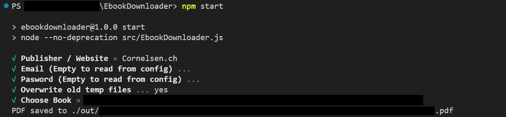

# EbookDownloader
A tool to download purchased e-books from different publishers.



## Table of Contents
- [Supported Publishers (websites)](#supported-publishers-websites)
- [Automatic Installation](#automatic-installation)
- [Manual Installation](#manual-installation)
- [Running](#running)

## Supported Publishers (websites)
| Publisher | Website | Best Quality | Selectable Text | Hyperrefs | Notes |
| --- | --- | --- | --- | --- | --- |
| Cornelsen ("New Method") | cornelsen.de | Lossless PDF | &check; | &check; |  |
| Cornelsen ("Old Method") | cornelsen.de | Image (8617px x 11792px) composition | &check; | &cross; |  |
| Cornelsen.CH | ebooks.cornelsen.ch | Lossless PDF | &check; | &cross; |  |
| Cornelsen | scook.de | Image (?) composition | &cross; | &cross; | |
| Allango Klett | allango.net | Lossless PDF | &check; | ? | [1] |
| Klett | klett.de | Image (3072px x 4096px) composition | &check; | &check; | |
| Westermann | westermann.de | Image (2244px x 3071px) composition | &check; | &cross; | |
| C.C.BUCHNER | click-and-study.de | Image (1658px x 2211px) composition | &check; | &cross; | |
| Book2Look | book2look.com | Lossless PDF | &check; | ? | [2] |
| kiosquemag | kiosquemag.com | Image (?) composition | &cross; | &cross; | |

[1]: Website allows to download files that are not owned

[2]: No Account needed, only the book id

## Automatic Installation
At first, clone or download the repository.

The tool uses image processing libraries and has to be executed with nodejs, therefore some dependencies are required.

You can eiher use the installation scripts (`init.bat` for Windows, `init.sh` for Debian based distros) or use manual installation. The installation scripts will download all dependencies for you. To execute them, double click the `.bat` file on windows or execute the `.sh` file in the terminal on linux after adding execution permissions to the `.sh` file.

## Manual Installation
At first, clone or download the repository. Then follow the os-specific instructions below:

### Windows
1. Download `unifont-15.0.01.ttf` from http://www.unifoundry.com/pub/unifont/unifont-15.0.01/font-builds/unifont-15.0.01.ttf and put it in the project root
1. Install `ffmpeg` and put the ffmpeg executable (named as `ffmpeg`) in the project root or add it to your path environment variable, if you need help you can follow [this](https://phoenixnap.com/kb/ffmpeg-windows) tutorial
1. Install `mutool` and put the mutool executable (named as `mutool`) in the project root or add it to your path environment variable, you can find the most recent builds [here](https://mupdf.com/releases). Search for releases with `windows`. (only required for book2look and cornelsen.ch)
1. Install `nodejs` and `npm` if you haven't already, you can find help [here](https://phoenixnap.com/kb/install-node-js-npm-on-windows)
1. Run `npm install`
1. Optionally install `image magick` and put the magick executable (named as `magick`) in the project root or add it to your path environment variable (required only for cornelsen "old method")

### Linux
1. Run `wget "http://www.unifoundry.com/pub/unifont/unifont-15.0.01/font-builds/unifont-15.0.01.ttf"`
1. Install packages `ffmpeg`, `nodejs`, `mutool`/`mupdf-tools`/`mupdf`  (required for book2look and cornelsen.ch) and optionally `imagemagick` (required only for cornelsen "old method") with your favorite package manager
1. Run `npm install`

### Linux/Darwin with Nix
- If you have nix-direnv, run `direnv allow` to obtain all dependencies
- Otherwise, run `nix-shell`.
- Run `wget "http://www.unifoundry.com/pub/unifont/unifont-15.0.01/font-builds/unifont-15.0.01.ttf"`

## Running
Complete the setup by running `npm install` in the project directory and
start the program by executing `npm start` from the project directory.

## Saving credentials to avoid entering them every time (optional)
You can save your credentials in a `config.json` file to avoid entering them every time you start the program. To do this, create a file named `config.json` in the project root and add the following content:

```json
{
    "[PUBLISHER]": {
        "email": "[YOUR_USERNAME_OR_EMAIL]", 
        "passwd": "[YOUR_PASSWORD]"
    },
    "[PUBLISHER]": {
        "email": "[YOUR_USERNAME_OR_EMAIL]", 
        "passwd": "[YOUR_PASSWORD]"
    }
    [...]
}
```

Replace all the square brackets with your data. Publisher keys are: `cornelsen`, `klett`, `allango`, `scook`, `westermann`, `clicknstudy`, `kiosquemag`, `cornelsench`, `book2look` 

## Bildungslogin

Cornelsen and Westermann have token-login support, allowing login using Bildungslogin accounts.

### Cornelsen

1. Open Bildungslogin and log in
1. Go into Storage devtools (SHIFT+F9, or alternatively press CTRL+SHIFT+I and click on Storage tab).
1. Open the book
1. Select Local storage in the devtools (possibly also need to select the website in it)
1. Scroll down in the table that opens until you find `id_token`. It should be a long alphanumeric string.
1. Copy it. (Double click, then ctrl+c)
1. Use it as the password, and use `token` as the username.

### Westermann

1. Open Bildungslogin and log in
1. Open the book
1. Go into Networking devtools (CTRL+SHIFT+E, or alternatively press CTRL+SHIFT+I and click on Network tab).
1. Tick `Persist logs` (possibly in Gear menu, likely at top right somewhere)
1. Reload the page
1. Enter `/api/user` into the "Filter URLs" field of devtools
1. Click the first entry that does *not* say OPTIONS
1. A little pane to the side should open. Click on its Headers tab
1. Enter `auth` into its "Filter headers" field (if available)
1. Scroll down until you find a long string of letters and numbers
1. Copy it and paste it into a text document
1. Copy it from there again, but make sure NOT to select the "Authorization: Bearer " part, only the long string at the end.
1. Use it as the password, and use `token` as the username.

## Contributing

Feel free to create issues and pull requests to contribute to the project.

## Disclaimer
This project is for educational purposes only. The project is not responsible for any misuse of the software. Depending on your jurisdiction, it may be illegal to use this software to download e-books without the consent of the publisher. In other jurisdictions, it may be legal to download e-books for personal use only. Please check your local laws before using this software.
